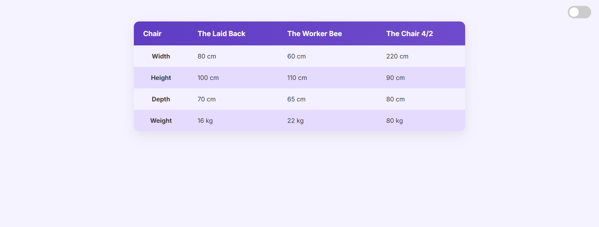
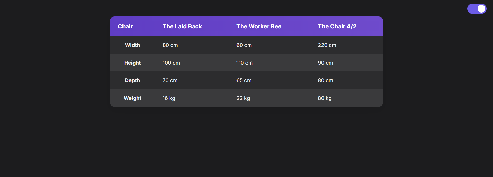

# 📊 Responsive Comparison Table with Dark Mode

A modern, accessible, and responsive **comparison table** component featuring zebra-striping, hover effects, and a fully switchable **dark mode**. Built using pure **HTML, CSS, and JavaScript**, this table is ideal for showcasing product specs, feature comparisons, or pricing data.

---

## 🎨 Features

- 🌓 Dark mode toggle with smooth transitions
- 🔁 Alternating row backgrounds for better readability
- 🖱️ Hover effects on rows for interactivity
- 📱 Fully responsive and centered layout
- 🧼 Clean design with modern fonts and soft color palette

---

## 🛠️ Built With

| Technology    | Purpose                |
| ------------- | ---------------------- |
| 🧱 HTML5      | Structure              |
| 🎨 CSS3       | Styling                |
| ⚙️ JavaScript | Dark Mode Toggle Logic |

---

## 📸 Screenshot

---

## 🌐 Live Demo

🔗 **GitHub Pages:**

---

## 📧 Let’s Connect

🔗 **LinkedIn:**  
[https://www.linkedin.com/in/gaurav-lad1974](https://www.linkedin.com/in/gaurav-lad1974)

📨 **Email:**  
gauravlad1974@gmail.com
